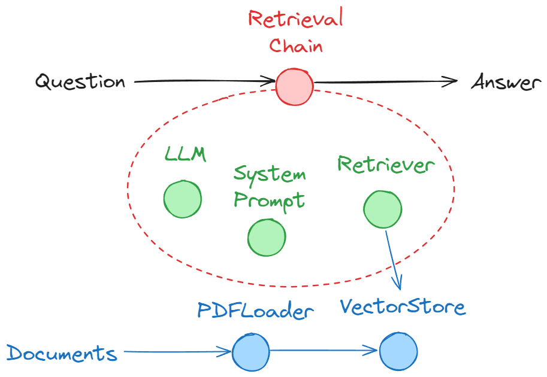
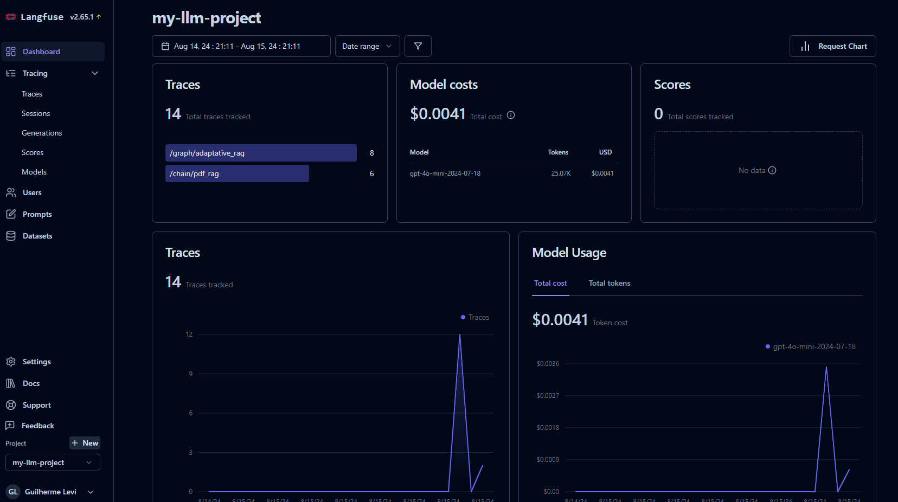
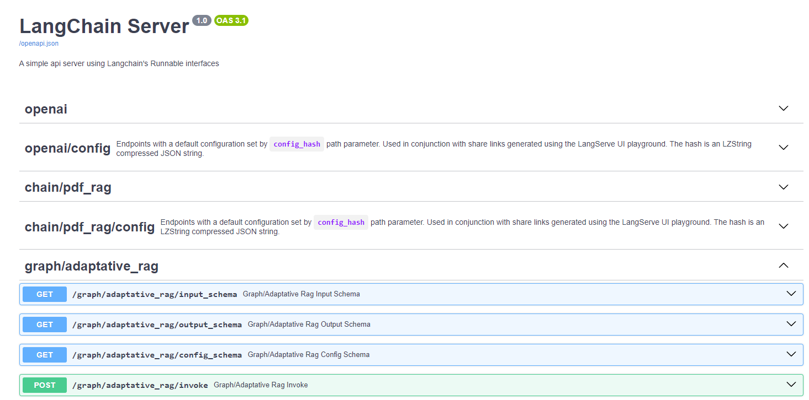
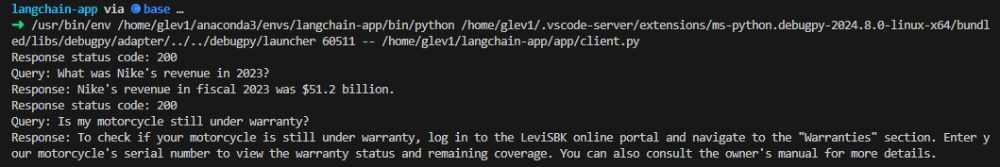

# LangChain Playground

This repository serves as a playground to demonstrate various tools and functionalities available in the LangChain framework. It includes implementations of two key use cases: **Simple RAG with PDF Loader** and **Adaptive RAG**. Both use cases are configured with monitoring using LangFuse and can be accessed via a FastAPI-based API.

## Use Cases

### 1. Simple RAG with PDF Loader



This use case demonstrates a simple Retrieval-Augmented Generation (RAG) system where documents are loaded from PDFs. The text embeddings are stored in a vector store, which can be either **FAISS** or **ChromaDB**.

### 2. Adaptive RAG


This use case showcases a more complex RAG system that incorporates self-reflection and uses **LangGraph** to adaptively refine responses based on the retrieved information.

## Monitoring
Both use cases are integrated with **LangFuse** for real-time monitoring and analytics, allowing you to track the performance and usage of the RAG systems. For more information, refer to the [LangFuse Documentation](https://langfuse.com/docs).



## Getting Started

### Prerequisites
- Python 3.9 or higher
- (Optional) Deploy [Langfuse](https://langfuse.com/docs/deployment/self-host)

### Installation

1. Clone this repository:
    ```bash
    cd $HOME && git clone https://github.com/glev1/langchain-playground.git
    cd $HOME/langchain-playground
    ```

2. (Optional) Configure conda or venv
    ```bash
    conda create -n langchain-app python=3.11
    conda activate langchain-app
    ```

    or

    ```bash
    conda create -n langchain-app python=3.11
    conda activate langchain-app
    ```

3. Install the required dependencies:
    ```bash
    pip install -r requirements.txt
    ```

4. Configure your environment variables using a ```.env``` file.

    ```
    OPENAI_API_KEY=sk-***
    LANGFUSE_PUBLIC_KEY=pk-***
    LANGFUSE_SECRET_KEY=sk-***
    LANGFUSE_HOST=http://localhost:3000
    TAVILY_API_KEY=tvly-***
    ```

### Running the API

The use cases are accessible through a FastAPI-based API. To start the server, run the following command:

```bash
cd app
python3 server.py
```

You can access the Swagger documentation and test the endpoints directly via the browser on ```http://localhost:8000/docs```. 





Or run the client script:

```bash
cd app
python3 client.py
```


